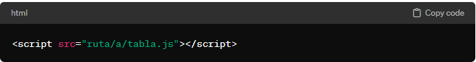

# tabla-js
es una librería JavaScript que te permite crear y manipular tablas de datos de manera sencilla y eficiente. Utiliza Bootstrap 4.5 o superior para garantizar una apariencia moderna y adaptable.

**Características**
- Creación de tablas dinámicas a partir de datos.
- Selección de filas (simple, múltiple o ninguna).
- Personalización de cabeceras y datos.
- Inclusión opcional de un buscador.

**Instalación**
Para utilizar Tabla.js, simplemente incluye el archivo tabla.js en tu proyecto:

Asegúrate de incluir también Bootstrap 4.5 o superior en tu proyecto si deseas aprovechar sus estilos.

**Uso**

**Documentación Completa**
Para obtener información detallada sobre las funciones disponibles y su uso, consulta la documentación completa en el archivo DOCUMENTACION.docx.

**Contribuciones**
¡Las contribuciones son bienvenidas! Si deseas mejorar Tabla.js, no dudes en abrir un problema o enviar una solicitud de extracción.

**Licencia**
Este proyecto está bajo la Licencia MIT. Consulta el archivo LICENSE para obtener más detalles.
